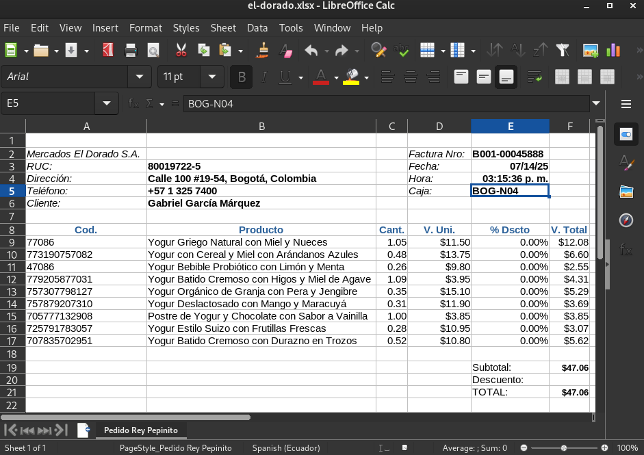
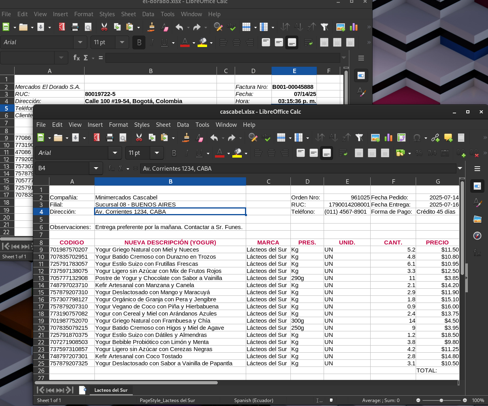
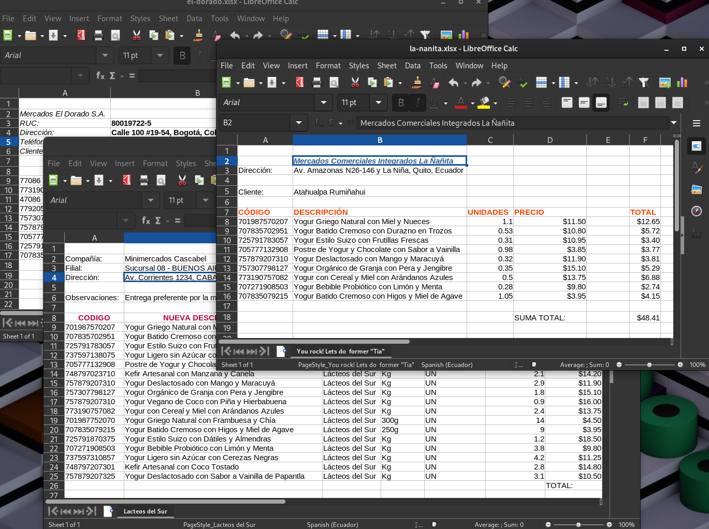

# Crónica de una Deuda Anunciada

Todo comienza un martes por la tarde. Llega un correo del gerente de ventas de la Pasteurizadora *Rey Pepinito*, marcado como "URGENTE". Uno de nuestros clientes más importantes, "Mercados El Dorado", necesita que sus pedidos Excel se carguen en el ERP. Y lo necesita para ayer.

La presión es alta para Regina, nuestra heroína y programadora estrella.

Como desarrolladora concienzuda, Regina sabe que la solución "correcta" sería construir una herramienta genérica. Pero eso tomaría días. Así que decide hacer lo "pragmático": un script rápido en Python.

En un par de horas, tiene un script que abre `PEDIDO_EL_DORADO.xlsx`, lee la columna `"Cant."` y `"Cod."`, y genera los archivos para el ERP. **Funciona.** El gerente está feliz.

*"Ya lo mejoraré después, cuando haya tiempo"*, se dijo.

---

Una semana después, llega otro correo: *"¡El script fue un éxito! Ahora necesitamos lo mismo para 'Minimercados Cascabel'"*.

Regina abre su script y la realidad la golpea: el formato de Cascabel es diferente. Usan `"CODIGO"` y `"CANT."` en lugar de `"Cod."` y `"Cant."`.

La solución más rápida no es rediseñar. Es **copiar y pegar**.

Regina crea `formatoCascabel()`, cambia los nombres de las columnas. De nuevo, funciona. La pequeña deuda técnica acaba de empezar a cobrar intereses.

---

Llegan más clientes. Con cada uno, el proceso se repite. El script crece, convirtiéndose en un monstruo de funciones duplicadas.

Lo que empezó como una solución rápida ahora es una fuente constante de problemas. Los desarrolladores están atrapados en un ciclo de "apagar incendios".

No fue por falta de capacidad, sino por una serie de decisiones a corto plazo que, acumuladas, crearon un problema a largo plazo.

> Este script es el resultado de hacer siempre "aritmética" (`1+1`, `1+2`) en lugar de detenerse a pensar en "álgebra" (`x+y`).

---

  <a class="prev" href="index.html">← Inicio</a>
  1 / 10
  <a class="next" href="02-epiphany.html">Siguiente →</a>

---

*Alusión a 'Crónica de una Muerte Anunciada' (1981) de Gabriel García Márquez, novela sobre una tragedia que todos ven venir pero nadie evita.*
