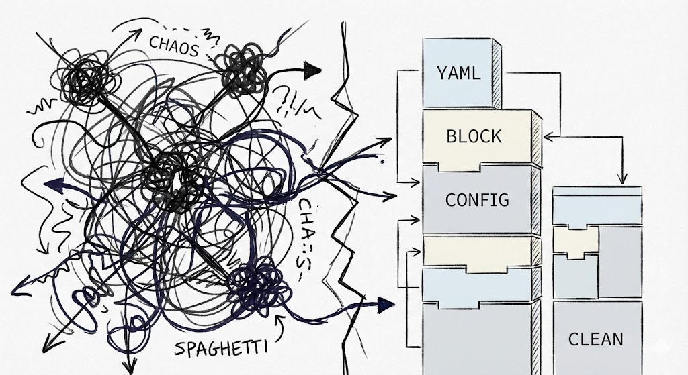
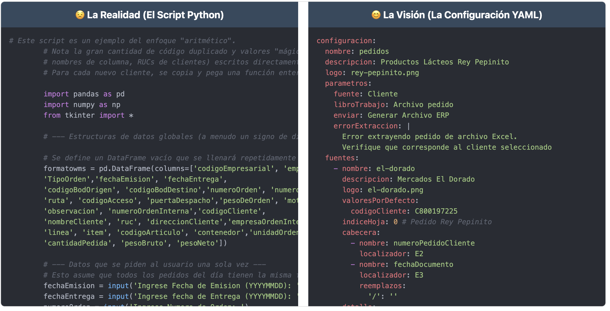

# La Visión vs. La Realidad

A la izquierda, el monstruoso script de Python (187 líneas). A la derecha, el archivo YAML que Regina imaginó.

---

Ver código Python completo (187 líneas)

<pre><code class="language-python"># Proceso de Pedidos — Productos Lácteos del Sur "Rey Pepinito"

import pandas as pd
import sys
import datetime

clientes = {
    'el_dorado': {'nombre': 'Mercados El Dorado', 'ruc': 'C800197225'},
    'cascabel': {'nombre': 'Minimercados Cascabel', 'ruc': 'C1790241008001'},
    'la_nanita': {'nombre': 'Restaurantes La Ñañita', 'ruc': 'C1701234567001'},
    # ... más clientes ...
}

def formato_el_dorado(archivo):
    df = pd.read_excel(archivo, sheet_name=0, header=7)
    df = df.dropna(subset=['Cod.'])
    # ... 20 líneas más de lógica específica ...

def formato_cascabel(archivo):
    df = pd.read_excel(archivo, sheet_name=0, header=7)
    df = df.dropna(subset=['CODIGO'])
    # ... 20 líneas más, casi idénticas ...

def formato_la_nanita(archivo):
    # ... otra copia con pequeñas variaciones ...

def formato_la_pinta(archivo):
    # ... y otra ...

def formato_uber_gross(archivo):
    # ... y otra más ...</code></pre>

Ver configuración YAML completa (97 líneas)

<pre><code class="language-yaml">config:
  name: pedidos
  description: Productos Lácteos Rey Pepinito
  sources:
    - name: el-dorado
      description: Mercados El Dorado
      defaultValues:
        CardCode: C800197225
      header:
        - name: NumAtCard
          locator: E2
        - name: DocDate
          locator: E3
      detail:
        locator: A8
        properties:
          - name: ItemCode
            locator: Cod.
          - name: Quantity
            locator: Cant.
    - name: cascabel
      description: Minimercados Cascabel
      defaultValues:
        CardCode: C1790014208001
      detail:
        locator: A8
        properties:
          - name: ItemCode
            locator: CODIGO
          - name: Quantity
            locator: CANT.
    # ... más clientes, solo datos ...</code></pre>

---

La diferencia es clara:

- **Python**: Para añadir un cliente, copiar y pegar 20 líneas, cambiar valores a mano. Propenso a errores.
- **YAML**: Para añadir un cliente, agregar un bloque de texto. El motor hace el resto.

---

  <a class="prev" href="02-epiphany.html">← Anterior</a>
  3 / 10
  <a class="next" href="04-analysis.html">Siguiente →</a>

