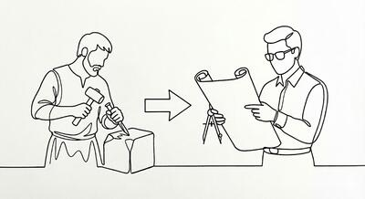

# De Artesanos a Arquitectos

Regina finalmente lo comprende. No se trata de no poder cambiar las cosas, sino de hacerlo de una manera más predecible y segura.

---

*"Y lo mejor de todo"*, concluye Dárico, *"es que esta forma de pensar no es exclusiva de Kotlin. Estas ideas — `map`, `filter`, `fold` — existen en C#, en Python, en JavaScript, en Java moderno... Están ahí, esperando a que las usemos"*.

---

Para Regina, este proyecto ha sido más que una simple tarea. Ha sido una **transformación** en su manera de pensar como desarrolladora.

Ha pasado de ser una "expansora de plantillas" a ser una "intérprete de metadatos".

Ha dejado la aritmética para abrazar el álgebra.

---

## Resumen

| Antes | Después |
|-------|---------|
| Código "aritmético" (1+1, 1+2) | Código "algebraico" (x+y) |
| Copiar y pegar funciones | Configuración declarativa |
| El programador como "máquina de café" | El programador como **arquitecto** |
| Resolver un problema | Resolver una **clase** de problemas |

---

El código fuente está disponible en el [repositorio GitHub](https://github.com/xrrocha/excel2erp).

¿Comentarios? [Déjame saber](mailto:ricardo@xrrocha.net).

---

  <a class="prev" href="09-functional.html">← Anterior</a>
  10 / 10
  <a class="next" href="index.html">Volver al inicio →</a>

