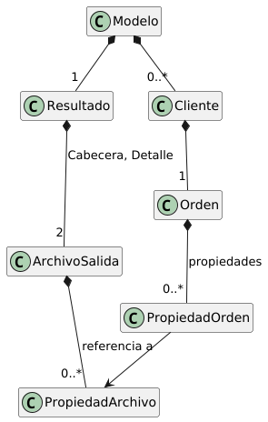
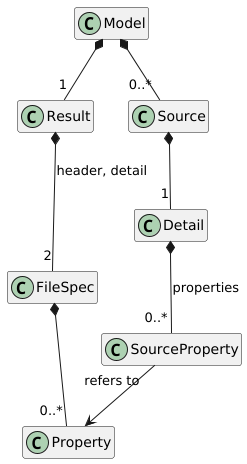
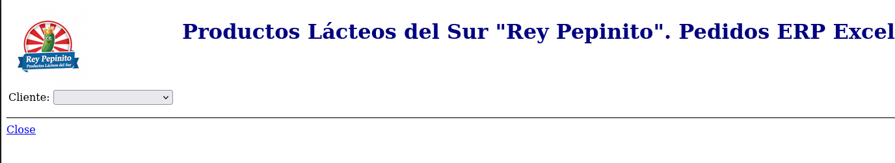
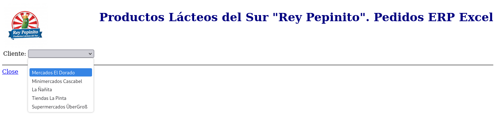
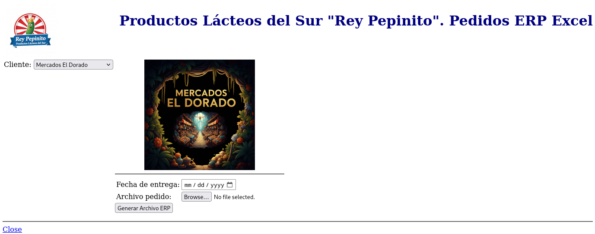
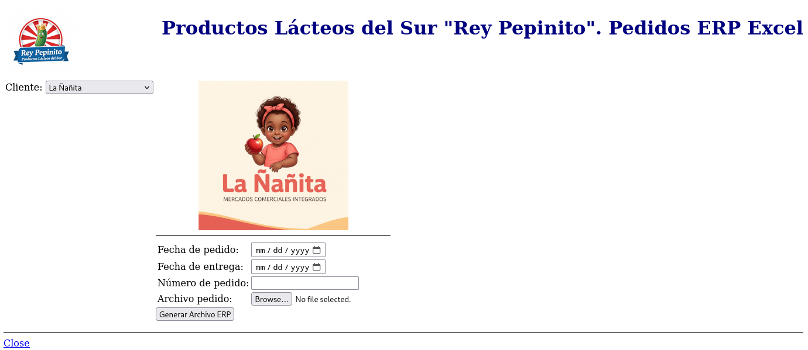

<section markdown="1">


<audio controls style="width: 100%; max-width: 400px;">
  <source src="de-la-aritmetica-al-algebra-en-programacion.mp3" type="audio/mpeg">
  🎧 Tu navegador no soporta audio. <a href="de-la-aritmetica-al-algebra-en-programacion.mp3">Descargar MP3</a> (8 min)
</audio>

Un script rápido para convertir pedidos Excel al formato del ERP funcionó... hasta que cada nuevo cliente trajo su propio formato y, con él, su propia lógica repetitiva, añadiendo a la complejidad. La solución "copiar y pegar" colapsó bajo su propio éxito.

- El código **"aritmético"** (copiar-pegar) crea deuda técnica inevitable: cada cliente nuevo requiere duplicar funciones enteras.
- La alternativa **"algebraica"** usa metadatos declarativos (YAML) para describir *qué* extraer, no *cómo*.
- Resultado: soportar un nuevo formato Excel requiere solo editar configuración. Cero código, cero recompilación.
- Herramientas: **Kotlin** + **HTMX** + **YAML** — simplicidad sin sacrificar poder.

</section>

<section markdown="1">

## La Historia de un Script: Crónica de una Deuda Anunciada[^1]


Todo comienza un martes por la tarde. Llega un correo del gerente de ventas de la Pasteurizadora *Rey Pepinito*, un correo marcado como "URGENTE". Uno de nuestros clientes más importantes, "Mercados El Dorado", necesita que sus pedidos, enviados en un archivo Excel, se carguen en el ERP. Y lo necesita para ayer. La presión es alta para Regina, nuestra heroína y programadora estrella de Rey Pepinito. 


Como desarrolladora concienzuda, Regina sabe que la solución "correcta" sería construir una herramienta genérica, configurable. Pero eso tomaría varios días, quizás más de una semana. El negocio no puede esperar. Así que decide hacer lo "pragmático": escribe un script rápido y "sucio". En un par de horas, tiene un script en Python que abre `PEDIDO_EL_DORADO.xlsx`, lee la cantidad de la columna `"Cant."`, el código de la columna `"Cod."`, y genera los archivos para el ERP. Funciona. El gerente está feliz, Regina se siente, en verdad, como una heroína. "Ya lo mejoraré después, cuando haya tiempo", se dijo. 


Una semana después, llega otro correo: "¡El script fue un éxito! Ahora necesitamos lo mismo para 'Minimercados Cascabel'". Regina abre su script y la realidad la golpea: el formato de Cascabel es diferente. Usan la columna `"CODIGO"` y `"CANT."`. La solución más rápida no es rediseñar todo. Es copiar y pegar. Regina crea una nueva función, `formatoCascabel()`, y cambia los nombres de las columnas. De nuevo, funciona. El problema está resuelto. La pequeña deuda técnica que adquirió la semana pasada acaba de empezar a cobrar intereses. 


Llegan más clientes. Con cada uno, el proceso se repite. El script crece, convirtiéndose en un monstruo de funciones duplicadas. Lo que empezó como una solución rápida ahora es una fuente constante de problemas. Los desarrolladores de Rey Pepinito están atrapados en un ciclo de "apagar incendios". No fue por falta de capacidad, sino por una serie de decisiones a corto plazo que, acumuladas, crearon un problema a largo plazo. Este script es el resultado de hacer siempre "aritmética" (`1+1`, `1+2`) en lugar de detenerse a pensar en "álgebra" (`x+y`). 


</section>

<section markdown="1">

## La Epifanía: ¿Y si Describimos el Problema?


Regina, la desarrolladora que creó el script original, se da cuenta de que las cosas han ido demasiado lejos. El script se ha vuelto tan complejo y frágil que "nadie quiere tocarlo". Peor aún, los usuarios de ventas tienen que completar datos a mano antes de ejecutarlo, lo que provoca errores y frustración. La "solución rápida" se ha convertido en el problema de todos. 


Una tarde, mientras mira el código enredado, tiene una revelación. Se pregunta: *"¿Y si dejo de escribir código para cada cliente? ¿Y si, en lugar de eso, pudiera simplemente **describir** lo que necesito de cada archivo Excel? ¿Cómo se vería esa descripción?"* 


No piensa en el código para implementarlo todavía. Solo se enfoca en la pregunta: si Dios fuera misericordioso y me concediera este Santo Grial, ¿cómo serían esos "metadatos"? Saca un editor de texto y empieza a imaginar. Elige YAML porque es limpio y legible para los humanos. Su visión empieza a tomar forma, y el resultado es una descripción elegante del problema.

</section>

<section markdown="1">

## El Contraste Visual: La Visión vs. La Realidad

A continuación, vemos el fruto de esa epifanía. A la derecha, el archivo de configuración YAML que ella imaginó: una descripción clara y concisa del problema. A la izquierda, el monstruoso script de Python que este nuevo enfoque está destinado a reemplazar.


<details>
<summary>📜 Ver código completo: <strong>La Realidad</strong> (Python, 187 líneas)</summary>

```python
# Proceso de Pedidos — Productos Lácteos del Sur "Rey Pepinito"
# Procesar pedidos Excel de clientes y generar archivos ERP.
#
# USO:
#   python pedidos-rey-pepinito.py <archivo-excel>
#
# EJEMPLO:
#   python pedidos-rey-pepinito.py PEDIDO_EL_DORADO.xlsx

import pandas as pd
import numpy as np
import sys
import datetime

# Datos de los clientes
clientes = {
    'el_dorado': {'nombre': 'Mercados El Dorado', 'ruc': 'C800197225'},
    'cascabel': {'nombre': 'Minimercados Cascabel', 'ruc': 'C1790241008001'},
    'la_nanita': {'nombre': 'Restaurantes La Ñañita', 'ruc': 'C1701234567001'},
    'la_pinta': {'nombre': 'Supermercados La Pinta', 'ruc': 'C102345678'},
    'uber_gross': {'nombre': 'Supermercados ÜberGroß', 'ruc': 'CDE123456789'},
}

# Mapa de códigos especiales
codigos_especiales = {
    '77086': '701987570207',
    '47086': '707271908503',
}


def formato_el_dorado(archivo):
    df = pd.read_excel(archivo, sheet_name=0, header=7)
    df = df.dropna(subset=['Cod.'])

    # Encabezado
    df_header = pd.read_excel(archivo, sheet_name=0, header=None)
    num_pedido = str(df_header.iloc[1, 4])
    fecha_pedido = str(df_header.iloc[2, 4]).replace('/', '')

    detalle = []
    for idx, row in df.iterrows():
        codigo = str(row['Cod.']).split('.')[0]
        codigo = codigos_especiales.get(codigo, codigo)
        cantidad = str(row['Cant.']).split('.')[0]
        detalle.append({'ItemCode': codigo, 'Quantity': cantidad})

    return {
        'cliente': clientes['el_dorado'],
        'NumAtCard': num_pedido,
        'DocDate': fecha_pedido,
        'detalle': detalle
    }


def formato_cascabel(archivo):
    df = pd.read_excel(archivo, sheet_name=0, header=7)
    df = df.dropna(subset=['CODIGO'])

    # Encabezado
    df_header = pd.read_excel(archivo, sheet_name=0, header=None)
    num_pedido = str(df_header.iloc[1, 4])
    fecha_pedido = str(df_header.iloc[1, 6]).replace('-', '')

    detalle = []
    for idx, row in df.iterrows():
        codigo = str(row['CODIGO']).split('.')[0]
        cantidad = str(row['CANT.']).split('.')[0]
        detalle.append({'ItemCode': codigo, 'Quantity': cantidad})

    return {
        'cliente': clientes['cascabel'],
        'NumAtCard': num_pedido,
        'DocDate': fecha_pedido,
        'detalle': detalle
    }


def formato_la_nanita(archivo):
    df = pd.read_excel(archivo, sheet_name=0, header=6)
    df = df.dropna(subset=['CÓDIGO'])

    detalle = []
    for idx, row in df.iterrows():
        codigo = str(row['CÓDIGO']).split('.')[0]
        cantidad = str(row['UNIDADES']).split('.')[0]
        detalle.append({'ItemCode': codigo, 'Quantity': cantidad})

    # La Ñañita no provee fechas ni número de pedido en el Excel
    return {
        'cliente': clientes['la_nanita'],
        'NumAtCard': None,
        'DocDate': None,
        'detalle': detalle
    }


def formato_la_pinta(archivo):
    df = pd.read_excel(archivo, sheet_name=0, header=7)
    df = df.dropna(subset=['COD.'])

    # Encabezado
    df_header = pd.read_excel(archivo, sheet_name=0, header=None)
    num_pedido = str(df_header.iloc[1, 3])

    detalle = []
    for idx, row in df.iterrows():
        codigo = str(row['COD.']).split('.')[0]
        cantidad = str(row['CANT.']).split('.')[0]
        detalle.append({'ItemCode': codigo, 'Quantity': cantidad})

    return {
        'cliente': clientes['la_pinta'],
        'NumAtCard': num_pedido,
        'DocDate': None,
        'detalle': detalle
    }


def formato_uber_gross(archivo):
    df = pd.read_excel(archivo, sheet_name=0, header=6)
    df = df.dropna(subset=['CODIGO'])

    # Encabezado
    df_header = pd.read_excel(archivo, sheet_name=0, header=None)
    num_pedido = str(df_header.iloc[1, 3])
    fecha_pedido = str(df_header.iloc[2, 3]).replace('-', '')
    fecha_entrega = str(df_header.iloc[3, 3]).replace('-', '')

    detalle = []
    for idx, row in df.iterrows():
        codigo = str(row['CODIGO']).split('.')[0]
        cantidad = str(row['CANTIDAD']).split('.')[0]
        detalle.append({'ItemCode': codigo, 'Quantity': cantidad})

    return {
        'cliente': clientes['uber_gross'],
        'NumAtCard': num_pedido,
        'DocDate': fecha_pedido,
        'DocDueDate': fecha_entrega,
        'detalle': detalle
    }


def detectar_formato(archivo):
    """Detecta el formato del archivo basándose en el nombre"""
    nombre = archivo.upper()
    if 'DORADO' in nombre:
        return formato_el_dorado
    elif 'CASCABEL' in nombre:
        return formato_cascabel
    elif 'NANITA' in nombre or 'ÑAÑITA' in nombre:
        return formato_la_nanita
    elif 'PINTA' in nombre:
        return formato_la_pinta
    elif 'UBER' in nombre or 'GROSS' in nombre:
        return formato_uber_gross
    else:
        raise ValueError(f'Formato desconocido: {archivo}')


def generar_erp(datos):
    """Genera los archivos ERP a partir de los datos extraídos"""
    cliente = datos['cliente']
    hoy = datetime.date.today().strftime('%Y%m%d')

    # Archivo cabecera
    cabecera = f"1\t1\tdDocument_Items\t{datos.get('DocDate', hoy)}\t{datos.get('DocDueDate', hoy)}\t{cliente['ruc']}\t{datos.get('NumAtCard', '')}\n"

    # Archivo detalle
    detalle_lines = []
    for idx, item in enumerate(datos['detalle'], 1):
        detalle_lines.append(f"1\t{idx}\t{item['ItemCode']}\t{item['Quantity']}\tBD-PTE")

    return cabecera, '\n'.join(detalle_lines)


def main():
    if len(sys.argv) != 2:
        print('Uso: python pedidos-rey-pepinito.py <archivo-excel>')
        sys.exit(1)

    archivo = sys.argv[1]
    formato = detectar_formato(archivo)
    datos = formato(archivo)
    cabecera, detalle = generar_erp(datos)

    # Guardar archivos
    with open('cabecera.txt', 'w') as f:
        f.write("DocNum\tDocEntry\tDocType\tDocDate\tDocDueDate\tCardCode\tNumAtCard\n")
        f.write("DocNum\tDocEntry\tDocType\tDocDate\tDocDueDate\tCardCode\tNumAtCard\n")
        f.write(cabecera)

    with open('detalle.txt', 'w') as f:
        f.write("ParentKey\tLineNum\tItemCode\tQuantity\tWarehouseCode\n")
        f.write("DocNum\tLineNum\tItemCode\tQuantity\tWhsCode\n")
        f.write(detalle)

    print(f'Archivos generados para {datos["cliente"]["nombre"]}')


if __name__ == '__main__':
    main()
```

</details>

<details>
<summary>📋 Ver código completo: <strong>La Visión</strong> (YAML, 153 líneas)</summary>

```yaml
port: 9090
assetsDir: ./assets
config:
  name: pedidos
  description: 'Productos Lácteos del Sur "Rey Pepinito". Pedidos ERP Excel'
  logo: rey-pepinito.png
  parameters:
    htmx: 'https://unpkg.com/htmx.org@2.0.6'
    source: Cliente
    workbook: Archivo pedido
    submit: Generar Archivo ERP
    extractionError: |
      Error extrayendo pedido de archivo Excel.
      Verifique que corresponde al cliente seleccionado
  sources:
    - name: el-dorado
      description: Mercados El Dorado
      logo: el-dorado.png
      defaultValues:
        CardCode: C800197225
      sheetIndex: 0 # Pedido Rey Pepinito
      header:
        - name: NumAtCard
          locator: E2
        - name: DocDate
          locator: E3
          replacements:
            '/': ''
      detail:
        locator: A8
        properties:
          - name: ItemCode
            locator: Cod.
            replacements:
              77086: 701987570207
              47086: 707271908503
          - name: Quantity
            locator: Cant.
    - name: cascabel
      description: Minimercados Cascabel
      logo: cascabel.png
      defaultValues:
        CardCode: C1790014208001
      sheetIndex: 0 # Lacteos del Sur
      header:
        - name: NumAtCard
          locator: E2
        - name: DocDate
          locator: G2
          replacements:
            '-': ''
      detail:
        locator: A8
        properties:
          - name: ItemCode
            locator: CODIGO
          - name: Quantity
            locator: CANT.
    - name: la-nanita
      description: La Ñañita
      logo: la-nanita.png
      defaultValues:
        CardCode: C1701234567001
      sheetIndex: 0 # Lacteos del Sur
      header: []
      detail:
        locator: A7
        properties:
          - name: ItemCode
            locator: CÓDIGO
          - name: Quantity
            locator: UNIDADES
    - name: la-pinta
      description: Tiendas La Pinta
      logo: la-pinta.png
      defaultValues:
        CardCode: C102345678
      sheetIndex: 0 # Lacteos del Sur
      header:
        - name: NumAtCard
          locator: D2
      detail:
        locator: A8
        properties:
          - name: ItemCode
            locator: COD.
          - name: Quantity
            locator: CANT.
    - name: uber-gross
      description: Supermercados ÜberGroß
      logo: uber-gross.png
      defaultValues:
        CardCode: CDE123456789
      sheetIndex: 0 # Lacteos del Sur
      header:
        - name: NumAtCard
          locator: D2
        - name: DocDate
          locator: D3
          replacements:
            '-': ''
        - name: DocDueDate
          locator: D4
          replacements:
            '-': ''
      detail:
        locator: A7
        properties:
          - name: ItemCode
            locator: CODIGO
          - name: Quantity
            locator: CANTIDAD
  result:
    separator: "\t"
    baseName: erp-pedido-${sourceName}-${NumAtCard}
    header:
      filename: cabecera.txt
      properties:
        - name: DocNum
          fyi: Número de pedido ERP
          defaultValue: 1
        - name: DocEntry
          defaultValue: 1
        - name: DocType
          defaultValue: dDocument_Items
        - name: DocDate
          type: date
          prompt: Fecha de pedido
        - name: DocDueDate
          type: date
          prompt: Fecha de entrega
        - name: CardCode
          prompt: RUC del cliente
        - name: NumAtCard
          prompt: Número de pedido
      prolog: |
        DocNum	DocEntry	DocType	DocDate	DocDueDate	CardCode	NumAtCard
        DocNum	DocEntry	DocType	DocDate	DocDueDate	CardCode	NumAtCard
    detail:
      filename: detalle.txt
      properties:
        - name: DocNum
          defaultValue: 1
        - name: LineNum
          defaultValue: ${index}
        - name: ItemCode
        - name: Quantity
        - name: WhsCode
          defaultValue: BD-PTE
      prolog: |
        ParentKey	LineNum	ItemCode	Quantity	WarehouseCode
        DocNum	LineNum	ItemCode	Quantity	WhsCode
```

</details>

</section>

<section markdown="1">

## Análisis de los Enfoques


La diferencia es clara. El script de Python es rígido. Para añadir un nuevo cliente, un programador debe copiar y pegar una función de 20 líneas, cambiando cuidadosamente valores como `'PEDIDO_EL_DORADO.xlsx'` o `'C800197225'`. Es un proceso lento y muy propenso a errores. 


El archivo YAML, en cambio, es una simple descripción. Para añadir un cliente, solo agregamos un nuevo bloque de texto que define sus características. El motor de ingesta de pedidos (el código "algebraico") lee esta configuración y hace el trabajo sin necesidad de ser modificado.

<div style="overflow-x: auto;">

| ⚙️ Aspecto | 😟 El Antiguo Camino (Aritmética) | 😊 El Nuevo Camino (Álgebra) |
|---|---|---|
| Añadir un Cliente | Un programador debe escribir código nuevo (copiar y pegar). Requiere un ciclo completo de desarrollo. | Se añade una entrada de datos al archivo YAML. Es un cambio de configuración, no de programación. |
| Repetición de Código | Extrema. La misma lógica se repite para cada cliente. Un error se debe corregir en muchos lugares. | Cero. La lógica está escrita una sola vez. Sigue el principio "No te repitas" (DRY). |
| Configuración | Enterrada en el código. Nombres de archivo, columnas y reglas de negocio son "strings mágicos". | Centralizada y clara. Todo está en el archivo YAML, la única "fuente de la verdad". |
| Mantenimiento | Difícil y arriesgado. Un cambio simple requiere buscar en un script largo y confuso. | Simple y seguro. Los cambios se hacen en el archivo YAML, que es fácil de leer. |

</div>

</section>

<section markdown="1">

## De "Máquina de Café" a Intérprete de Metadatos


Hay un viejo chiste que dice que "un programador es un dispositivo que convierte café en código". Es gracioso, pero hay una verdad más profunda. Quizás deberíamos decir: **"un programador es un dispositivo que convierte *metadatos* (requerimientos y especificaciones) en código"**. 


Es aquí donde los senderos se bifurcan. Un enfoque, el más instintivo, es el del **"expansor de plantillas"**. Recibimos los metadatos de un caso (el Excel del cliente A) y aplicamos una receta mental para generar código "aritmético" que lo resuelva. Cuando llega el cliente B, aplicamos la misma receta con ligeras variaciones. Esto es lo que Regina hizo con el script de Python. Es una reacción natural, pero nos convierte en simples ejecutores de una plantilla mental. 


El otro enfoque, el "algebraico", es el del **"intérprete de metadatos"**. En lugar de generar código nuevo para cada caso, construimos un sistema inteligente que *lee* los metadatos en tiempo de ejecución y actúa en consecuencia. No escribimos código para el cliente A o el cliente B. Escribimos un solo "motor" que entiende el *lenguaje* en el que se describen los clientes. 


Este es el salto conceptual en el que Regina incurrió. Se dio cuenta de que su valor no está en expandir la misma plantilla una y otra vez, sino en diseñar un *intérprete*. Es la diferencia entre escribir un script y diseñar un sistema. Es reconocer que los humanos somos mucho más que máquinas que convierten café en código repetitivo; somos arquitectos de soluciones.

</section>

<section markdown="1">

## Un Vistazo al "Motor": La Abstracción en Kotlin


Entusiasmada, Regina le muestra su "mapa" YAML a su novio, Dárico, y le explica cómo el modelo de datos que diseñó es el corazón del sistema que tiene en mente. 





Dárico regresó recientemente de trabajar en un proyecto de desarrollo Android en los Estados Unidos, donde reemplazó Java por Kotlin y, además, se inició en las artes de la programación funcional. 


Dárico queda impresionado con el mapa YAML. "Esto es brillante", le dice. "Has modelado perfectamente el 'qué'. Ahora, para construir el 'cómo', el motor, hay un par de desafíos interesantes que podríamos abordar con el lenguaje Kotlin pero, eso sí: en inglés". 


Al principio, ella duda. "¿Kotlin? ¿No es para celulares? Y... ¿escribir código en inglés? Apenas lo leo". Pero su novio, siempre comprensivo, la anima. "No te preocupes", le dice. "Todos conocemos las sintaxis de C# o Javascript, y Kotlin es muy parecido. Y en cuanto al inglés, es el idioma universal del código, te abrirá muchas puertas. Yo te ayudo con la terminología". 





Él le plantea un nuevo reto: "¿Qué pasa cuando el Excel de un cliente no incluye la fecha de entrega? El sistema ERP la necesita. La interfaz de usuario tendrá que pedirle ese dato al operador. ¿Cómo sabe el motor qué datos pedir para cada cliente?". 


Regina reflexiona. "Supongo que con un `if` gigante... si el cliente es *'La Ñañita'*, pedir la fecha...". 


Dárico sonríe. "Podríamos, pero ahí es donde vuelve a colarse la 'aritmética'. ¿Y si hacemos algo más 'mágico'? Aquí es donde la programación funcional nos da superpoderes. En lugar de escribir código que *extrae* los datos, vamos a escribir código que **construye una función extractora** sobre la marcha, basada en la configuración". 


Le explica que pueden crear una función que compare las propiedades que el ERP necesita con las que el YAML dice que están en el Excel. El resultado de esa comparación no es solo una lista de campos faltantes para la UI, sino también una **función a medida**, una especie de "extractor personal" para ese cliente específico, lista para ser ejecutada. "¡Es como si el código se escribiera a sí mismo!", concluye él. 


Otro detalle práctico surge: el ERP no acepta un solo archivo, sino varios (cabecera, detalle). "No hay problema", dice ella, cada vez más segura. "El motor puede empaquetar todo en un archivo ZIP al final. Eso también puede ser parte de la lógica general". 

### El Modelo de Datos: El "ADN" de la Solución


Dárico traduce el archivo YAML imaginado por Regina y que tanto lo impresionó:

<details>
<summary>📋 <code>excel2erp.yaml</code> — Configuración YAML completa (97 líneas)</summary>

```yaml
config:
  name: pedidos
  description: Productos Lácteos Rey Pepinito
  logo: rey-pepinito.png
  parameters:
    source: Cliente
    workbook: Archivo pedido
    submit: Generar Archivo ERP
    extractionError: |
      Error extrayendo pedido de archivo Excel.
      Verifique que corresponde al cliente seleccionado
  sources:
    - name: el-dorado
      description: Mercados El Dorado
      logo: el-dorado.png
      defaultValues:
        CardCode: C800197225
      sheetIndex: 0
      header:
        - name: NumAtCard
          locator: E2
        - name: DocDate
          locator: E3
          replacements:
            '/': ''
      detail:
        locator: A8
        properties:
          - name: ItemCode
            locator: Cod.
            replacements:
              77086: 701987570207
              47086: 707271908503
          - name: Quantity
            locator: Cant.
    - name: cascabel
      description: Minimercados Cascabel
      logo: cascabel.png
      defaultValues:
        CardCode: C1790241008001
      sheetIndex: 0
      header:
        - name: NumAtCard
          locator: E2
        - name: DocDate
          locator: G2
          replacements:
            '-': ''
      detail:
        locator: A8
        properties:
          - name: ItemCode
            locator: CODIGO
          - name: Quantity
            locator: CANT.
  result:
    separator: "\t"
    baseName: erp-pedido-${sourceName}-${NumAtCard}
    header:
      filename: cabecera.txt
      properties:
        - name: DocNum
          fyi: Número de pedido ERP
          defaultValue: 1
        - name: DocEntry
          defaultValue: 1
        - name: DocType
          defaultValue: dDocument_Items
        - name: DocDate
          type: date
          prompt: Fecha de pedido
        - name: DocDueDate
          type: date
          prompt: Fecha de entrega
        - name: CardCode
          prompt: RUC del cliente
        - name: NumAtCard
          prompt: Número de pedido
      prolog: |
        DocNum	DocEntry	DocType	DocDate	DocDueDate	CardCode	NumAtCard
        DocNum	DocEntry	DocType	DocDate	DocDueDate	CardCode	NumAtCard
    detail:
      filename: detalle.txt
      properties:
        - name: DocNum
          defaultValue: 1
        - name: LineNum
          defaultValue: ${index}
        - name: ItemCode
        - name: Quantity
        - name: WhsCode
          defaultValue: BD-PTE
      prolog: |
        ParentKey	LineNum	ItemCode	Quantity	WarehouseCode
        DocNum	LineNum	ItemCode	Quantity	WhsCode

```

</details>

Veamos a continuación el código Kotlin que implementa esta visión. Prestemos atención a los comentarios en español, que explican cómo cada pieza del rompecabezas encaja.

<details>
<summary>📄 <code>Model.kt</code> — El modelo de datos y la "magia" funcional (158 líneas)</summary>

```kotlin
// Este es el "motor" completo. Define tanto la estructura de los datos
// como el comportamiento (la lógica) para procesarlos.

/**
 * El modelo principal que contiene toda la configuración de la aplicación,
 * leída directamente desde el archivo YAML.
 */
data class Model(
    val name: String,
    val description: String,
    val logo: String,
    val parameters: Map<String, String>,
    val result: Result,
    val sources: List<Source>
)

/**
 * Representa el resultado final: los archivos que se generarán para el ERP.
 */
data class Result(
    val baseName: String,
    val separator: String,
    val header: FileSpec,
    val detail: FileSpec
) {
    /**
     * Esta función es la responsable de tomar los datos extraídos y
     * empaquetarlos en un archivo .zip, que es lo que el ERP espera.
     */
    fun writeZip(
        outputStream: OutputStream,
        headerData: Map<String, String?>,
        detailData: List<Map<String, String?>>
    ) =
        ZipOutputStream(outputStream).also { zos ->
            zos.putNextEntry(ZipEntry(header.filename))
            zos.write(header.content(separator, headerData).toByteArray())
            zos.closeEntry()
            zos.putNextEntry(ZipEntry(detail.filename))
            zos.write(detail.content(separator, detailData).toByteArray())
            zos.closeEntry()
            zos.flush()
            zos.close()
        }
}

/**
 * Describe una propiedad individual que el ERP necesita, por ejemplo, "DocDate".
 * Incluye información para la UI, como el tipo de input y el texto a mostrar.
 */
data class Property(
    val name: String,
    val type: InputType = text,
    val prompt: String = name,
    val fyi: String = prompt,
    val defaultValue: String? = null
)

/**
 * Describe un archivo de salida (cabecera.txt o detalle.txt).
 * Sabe cómo construir su contenido a partir de una lista de propiedades.
 */
data class FileSpec(
    val filename: String,
    val prolog: String = "",
    val epilog: String = "",
    val properties: List<Property>
) {
    // ... implementación para generar contenido de archivo ...
}

/**
 * Describe una propiedad en el archivo Excel de origen, incluyendo su
 * localizador (ej: "E2" o "CODIGO") y posibles reemplazos de texto.
 */
data class SourceProperty(
    val name: String,
    val locator: String,
    val replacements: Map<String, String> = emptyMap()
) {
    // ... implementación para convertir valores ...
}

/**
 * Describe a un cliente (una fuente de datos).
 * Esta clase contiene la "magia" principal.
 */
data class Source(
    val name: String,
    val description: String,
    val logo: String? = null,
    val sheetIndex: Int = 0,
    val header: List<SourceProperty> = emptyList(),
    val detail: Detail,
    val defaultValues: Map<String, String?> = emptyMap()
) {
    /**
     * ¡AQUÍ OCURRE LA MAGIA!
     * Esta función no devuelve simples datos. Devuelve un PAR de:
     * 1. Una FUNCIÓN (un extractor) que sabe cómo leer el Excel de este cliente.
     * 2. Una LISTA de propiedades que faltan y que la UI debe solicitar al usuario.
     *
     * Compara las propiedades que el ERP necesita (headerSpec) con las que
     * este cliente provee (this.header), y determina cuáles están presentes
     * y cuáles están ausentes para construir el extractor a medida.
     */
    fun resolveHeader(
        headerSpec: FileSpec
    ): Pair<(Workbook) -> Map<String, String?>, List<Property>> {

        // Crea un mapa para buscar rápidamente las propiedades de este cliente.
        val headerMap = header.associateBy { it.name }

        // Particiona las propiedades requeridas por el ERP en dos grupos:
        // las que SÍ están definidas en el Excel de este cliente, y las que NO.
        val (presentProperties, absentProperties) =
            headerSpec.properties.partition { property ->
                headerMap.containsKey(property.name)
            }

        // De las propiedades ausentes, filtra las que tampoco tienen un valor por defecto.
        // Estas son las que la UI DEBE preguntar al usuario.
        val missingProperties = absentProperties.filterNot { absentProperty ->
            defaultValues.containsKey(absentProperty.name)
        }

        // Ahora, "sintetiza" la función extractora.
        // Esto es una lambda, una función anónima que se crea en tiempo de ejecución.
        val extractor = { wb: Workbook ->
            val sheet = wb.getSheetAt(sheetIndex)
            // Combina los valores por defecto con los extraídos del Excel.
            defaultValues +
                presentProperties.associate { property ->
                    val sourceProperty = headerMap[property.name]!!
                    val cellAddress = CellAddress(sourceProperty.locator)
                    val cellValue = sheet.cellAsString(cellAddress.row, cellAddress.column)
                    property.name to cellValue?.let(sourceProperty::convert)
                }
        }
        // Devuelve el par: la función extractora y la lista de propiedades faltantes.
        return Pair(extractor, missingProperties)
    }

    // ... Lógica similar para resolver los detalles del pedido ...
}

/**
 * Describe cómo extraer las filas de detalle de una hoja de Excel.
 */
data class Detail(
    val locator: String,
    val endValue: String? = null,
    val properties: List<SourceProperty>
) {
    // ... implementación para leer una tabla de datos de Excel ...
}

```

</details>

</section>

<section markdown="1">

## El Mapa y el Territorio: Cómo el YAML se Convierte en Código Vivo


Regina tiene su modelo de datos en Kotlin, una réplica exacta de su visión en YAML. Ahora se enfrenta a una pregunta clave: "¿Cómo hago para que el programa lea mi archivo YAML y cree estos objetos automáticamente? No quiero escribir un *parser* manual, eso sería volver al mismo problema de antes". 


Dárico le explica un concepto fundamental: el **Grafo de Objetos**. "Piensa en un organigrama", le dice. "Tienes un gerente general, que tiene varios directores a su cargo. Cada director tiene gerentes, y así sucesivamente. Todos esos objetos (personas) y sus relaciones forman un 'grafo'. Tu archivo YAML es exactamente eso: un organigrama de tu configuración. El objeto `Model` es el gerente general". 


"La belleza de esto", continúa, "es que no tienes que construir ese grafo a mano. Usamos una librería como **[Jackson](https://github.com/FasterXML/jackson-dataformats-text/tree/2.x/yaml)**, que es un 'traductor' universal. Le das el mapa (el archivo YAML) y el plano (tus `data classes` de Kotlin), y Jackson construye el territorio (el grafo de objetos en memoria) por ti. Inyecta la configuración directamente en el torrente sanguíneo de tu programa. No hay que decodificar nada manualmente". 


Le muestra el código que hace todo esto, el punto de entrada de la aplicación.

<details>
<summary>📄 <code>Excel2Erp.kt</code> — Punto de entrada: YAML → Grafo de objetos (20 líneas)</summary>

```kotlin
// File: Excel2Erp.kt
// Este es el "interruptor de encendido" de toda la aplicación.

fun main() {
    // 1. Cargar el archivo excel2erp.yml
    val configInputStream = openResource("excel2erp.yml")

    // 2. Crear el "traductor" (mapper) para YAML y Kotlin
    val mapper = ObjectMapper(YAMLFactory()).registerModule(KotlinModule.Builder().build())

    // 3. ¡LA MAGIA! Leer el YAML y construir el grafo de objetos "Model"
    val model: Model = mapper.readValue(configInputStream)

    // 4. A partir de aquí, todo el programa trabaja con el objeto "model",
    // que ya está vivo y completamente configurado.
    val server = WBServer(model)
    server.start()
}

```

</details>

Regina queda asombrada. Con una sola línea de código, `mapper.readValue(configInputStream)`, *todo* el complejo archivo YAML se ha transformado en un objeto `Model` vivo y navegable, con sus listas de `Source`, sus `FileSpec` y todas las propiedades anidadas. No hay bucles, no hay `if`s, no hay parsing manual. ¡El mapa se ha convertido en el territorio!

</section>

<section markdown="1">

## Tlön, Uqbar, HTMX[^2]: La Web Sin Complejidad Gratuita


Con el modelo de datos y el cargador de YAML listos, Regina se siente en control. "La parte del backend está clara", le dice a Dárico. "Pero ahora viene la parte que odio: la interfaz de usuario. No quiero meterme en un framework de JavaScript como React o Angular solo para un formulario simple. ¡Es una pesadilla de complejidad, `npm install`, `webpack`... no, gracias!". 


Dárico, siendo el especialista en UI, la sorprende. "Estoy totalmente de acuerdo", responde. "La programación de interfaces de usuario en la web se ha vuelto innecesariamente complicada. ¿Odias el abuso de JavaScript? Yo también. Por suerte, he encontrado la respuesta a toda esa basura". 


"Se llama **[HTMX](https://htmx.org/)**", continúa, mientras Regina lo mira con escepticismo. "Olvida todo lo que crees saber sobre desarrollo web moderno. La idea es volver a la simpleza de HTML. En lugar de que el servidor envíe datos JSON para que un framework de JavaScript los convierta en HTML en el navegador, ¿por qué no hacer que el servidor envíe directamente el HTML que necesitamos?". 


"Con HTMX", explica, "simplemente incluyes un pequeño archivo JavaScript, `htmx.js`, y listo. En tu HTML, añades unos atributos especiales. Por ejemplo, le dices a un menú desplegable: 'cuando el usuario seleccione una opción, haz una petición GET a `/forms` y pon el HTML que recibas dentro de este `<div>`'. Y ya está. Toda la lógica para generar el formulario dinámico se queda en el servidor, en nuestro código Kotlin, donde tú te sientes cómoda". 

### El Servidor Inteligente: Devolviendo HTML, no JSON


Dárico le muestra a Regina el código del servidor web que ha preparado usando **[Javalin](https://javalin.io/)**, un micro-framework para Kotlin tan ligero y simple como su filosofía. El código es sorprendentemente pequeño y legible.

<details>
<summary>📄 <code>Server.kt</code> — Servidor web con HTMX (87 líneas)</summary>

```kotlin
// File: Server.kt
// El servidor web que atiende las peticiones del navegador.

import io.javalin.Javalin
import kotlinx.html.*
import kotlinx.html.stream.createHTML

data class Server(
    val port: Int = 7070,
    val assetsDir: String = "./assets",
    val config: Model
) {
    /**
     * Al iniciar, pre-calculamos los "extractores" y los formularios
     * para cada cliente definido en el YAML.
     */
    private val sources: Map<String, ResolvedSource> =
        config.sources.associate { source ->
            val (headerReader, missingProperties) = source.resolveHeader(config.result.header)
            val detailReader = source.resolveDetail(config.result.detail)
            source.name to ResolvedSource(headerReader, detailReader, source.logo, missingProperties)
        }

    fun start(): Javalin =
        Javalin.create { /*...*/ }
            .apply {

                get("/") { ctx -> ctx.html(index) }

                post("/load") { ctx ->
                    // ... aquí se procesa el archivo subido y se genera el ZIP ...
                }

                /**
                 * ¡LA MAGIA DE HTMX ESTÁ AQUÍ!
                 * Este es el endpoint que el formulario principal llama cuando
                 * Regina selecciona un cliente.
                 * No devuelve JSON. Devuelve un trozo de HTML puro.
                 */
                get("/forms") { ctx ->
                    // 1. Obtiene el nombre del cliente de la URL (ej: ?source=el-dorado)
                    val sourceName = ctx.queryParam("source")

                    // 2. Busca el cliente pre-procesado que corresponde a ese nombre.
                    val resolvedSource = sources[sourceName]

                    // 3. Devuelve directamente el HTML del formulario dinámico de ese cliente.
                    ctx.html(resolvedSource?.formHtml ?: "")
                }

                start(port)
            }

    /**
     * Clase interna que guarda la información ya procesada para un cliente.
     * Fíjate cómo "formHtml" es una propiedad que se calcula una sola vez.
     */
    inner class ResolvedSource(
        val headerReader: (Workbook) -> Map<String, String?>,
        val detailReader: (Workbook) -> List<Map<String, String?>>,
        logo: String?,
        val missingProperties: List<Property>
    ) {
        // Usando la librería KotlinX.html, generamos el HTML de forma segura y declarativa.
        val formHtml = createHTML().div {
            table {
                // Si hay propiedades faltantes, crea un campo de input para cada una.
                missingProperties.map { property ->
                    tr {
                        td { label { +"\${property.prompt}: " } }
                        td { input { name = property.name; type = property.type } }
                    }
                }
                // Añade el campo para subir el archivo y el botón de envío.
                tr {
                    td { label { +"\${config.parameter("workbook")}: " } }
                    td { input { type = file; name = "wbFile" } }
                }
            }
            div {
                input { type = submit; value = config.parameter("submit") }
            }
        }
    }
}

```

</details>

1) La página web inicial luce como:





2) Cuando se desea seleccionar "El Dorado" la página se ve como:





3) Cuando se quiere registrar los campos faltantes en el archivo Excel de "El Dorado" la página luce como:





4) Para "La Ñañita" la página es:





Regina lo ve claro. La complejidad de la UI se ha desvanecido. El navegador se encarga de lo que mejor sabe hacer: renderizar HTML. Y el servidor se encarga de la lógica, que es donde siempre debió estar. La combinación de un modelo de datos inteligente en Kotlin y la simplicidad de HTMX les ha dado una solución elegante, potente y, sobre todo, mantenible.

</section>

<section markdown="1">

## El Aleph de las Celdas[^3]: Navegando el Laberinto de Excel


Con el servidor web diseñado, Regina y Dárico llegan al núcleo del problema: leer los datos del archivo Excel. Regina suspira. "Ugh, esta es la parte que siempre me da problemas. Lidiar con Excel es un laberinto. Tienes que verificar el tipo de cada celda: si es texto, si es número, si es una fecha, ¡o peor, una fórmula! El código termina siendo un nido de sentencias `if` y bloques `try-catch`". 


Dárico asiente. "Es un problema clásico. Pero no vamos a reinventar la rueda. Mi primera idea fue usar **[Apache POI](https://poi.apache.org/)**, que es el estándar de la industria para trabajar con archivos de Microsoft Office". Hace una pausa. "Pero recordé algo que me contó un amigo. Él tuvo que distribuir una utilidad de línea de comandos como ejecutable nativo usando GraalVM, y POI le dio dolores de cabeza terribles. Resulta que POI usa reflexión intensivamente, y GraalVM no puede compilar a nativo bibliotecas que dependen tanto de reflexión".

"¿Y eso nos afecta?", pregunta Regina.

"Eventualmente sí", responde Dárico. "Queremos que nuestra solución sea portable: un ejecutable nativo que Regina pueda correr sin instalar Java. Así que usaremos **[FastExcel](https://github.com/dhatim/fastexcel)**, una biblioteca más ligera y moderna que funciona perfectamente con GraalVM. Pero aquí viene lo interesante", añade con un brillo en los ojos, "le daremos nuestro propio toque de superpoderes con una de las características más elegantes de Kotlin: las **funciones de extensión**".


"¿Funciones de qué?", pregunta Regina.


"Imagina que tienes un perro viejo, la clase `Cell` de FastExcel", explica Dárico. "Es un buen perro, pero no sabe hacer el truco que tú necesitas, como, por ejemplo, 'dame tu contenido como un String formateado, sin importar qué tipo de dato seas'. Con las funciones de extensión, podemos 'enseñarle' ese nuevo truco sin tener que modificar al perro original. Le añadimos funcionalidades a clases existentes como si fueran nuestras, haciendo nuestro propio código increíblemente limpio y legible".

### Enseñando Trucos Nuevos a Clases Viejas


Le muestra a Regina el archivo `Workbook.kt`. No contiene clases nuevas, sino una colección de "trucos" (funciones de extensión) que le enseñan a las clases de FastExcel a comportarse de una manera mucho más amigable y funcional. También incluye un `CachedSheet` que resuelve una peculiaridad de FastExcel: su API de streaming no permite acceso aleatorio, así que cacheamos las filas para poder navegar libremente.

<details>
<summary>📄 <code>Workbook.kt</code> — Funciones de extensión para FastExcel (132 líneas)</summary>

```kotlin
// File: Workbook.kt
// Este archivo extiende las clases de FastExcel con funcionalidades adicionales.
// FastExcel es una biblioteca ligera compatible con GraalVM native-image.

import org.dhatim.fastexcel.reader.Cell
import org.dhatim.fastexcel.reader.CellType
import org.dhatim.fastexcel.reader.ReadableWorkbook
import org.dhatim.fastexcel.reader.Row
import org.dhatim.fastexcel.reader.Sheet
import java.io.InputStream
import java.math.BigDecimal

/**
 * Representa una dirección de celda en notación A1 (ej: "A1", "B2", "AA10").
 * Convierte la notación alfanumérica a índices de fila y columna base-cero.
 */
data class CellAddress(val row: Int, val column: Int) {
    constructor(address: String) : this(
        row = address.dropWhile { it.isLetter() }.toInt() - 1,
        column = address.takeWhile { it.isLetter() }
            .fold(0) { acc, c -> acc * 26 + (c.uppercaseChar() - 'A' + 1) } - 1
    )
}

/** Obtiene una celda de forma segura, retornando null si el índice está fuera de rango. */
private fun Row.getCellOrNull(column: Int): Cell? =
    if (column < cellCount) getCell(column) else null

/**
 * CLASE ENVOLTORIO para Sheet de FastExcel.
 * FastExcel usa streaming y solo retorna filas con datos. Esta clase
 * cachea todas las filas para permitir acceso aleatorio por número de fila.
 * Nota: FastExcel usa índices 1-based, pero exponemos índices 0-based.
 */
class CachedSheet(sheet: Sheet) {
    // Convierte rowNum de 1-based a 0-based restando 1
    private val rowMap: Map<Int, Row> = sheet.read().associateBy { it.rowNum - 1 }
    private val maxRowNum: Int = rowMap.keys.maxOrNull() ?: -1

    fun getRow(rowIndex: Int): Row? = rowMap[rowIndex]

    fun cellAsString(row: Int, column: Int): String? =
        getRow(row)?.getCellOrNull(column)?.toFormattedString()

    /**
     * Lee una tabla completa de datos comenzando desde una posición dada.
     * Detecta automáticamente los límites de la tabla y mapea cada fila
     * a un diccionario (nombre_columna -> valor).
     */
    fun readTable(
        initialRow: Int,
        initialColumn: Int,
        endValue: String? = null
    ): List<Map<String, String?>> {
        val headerRow = getRow(initialRow) ?: return emptyList()

        // Encuentra la última columna (primera celda vacía en encabezados)
        val lastColumn = (initialColumn..Int.MAX_VALUE)
            .find { col ->
                headerRow.getCellOrNull(col)?.toFormattedString().isNullOrBlank()
            }?.minus(1) ?: (headerRow.cellCount - 1)

        // Extrae las etiquetas de la fila de encabezados
        val labels = (initialColumn..lastColumn).map { col ->
            headerRow.getCellOrNull(col)?.toFormattedString()
        }

        // Encuentra la última fila de datos
        val lastRow = (initialRow + 1..maxRowNum + 1)
            .find { rowIndex ->
                val row = getRow(rowIndex)
                if (endValue == null) {
                    row == null || row.getCellOrNull(0)?.toFormattedString()?.trim().isNullOrEmpty()
                } else {
                    val cell = row?.getCellOrNull(initialColumn)
                    cell == null || cell.toFormattedString() == endValue
                }
            }?.minus(1) ?: maxRowNum

        // Extrae las filas de datos como lista de mapas
        return (initialRow + 1..lastRow).mapNotNull { rowIndex ->
            val row = getRow(rowIndex) ?: return@mapNotNull null
            labels.indices.associate { colOffset ->
                val label = labels[colOffset] ?: "col$colOffset"
                val value = cellAsString(rowIndex, initialColumn + colOffset)
                label to value
            }
        }
    }
}

/** Abre un workbook desde un InputStream. */
fun openWorkbook(input: InputStream): ReadableWorkbook = ReadableWorkbook(input)

/** Obtiene una hoja cacheada para operaciones de acceso aleatorio. */
fun ReadableWorkbook.getCachedSheet(index: Int): CachedSheet =
    CachedSheet(getSheet(index).orElseThrow {
        IllegalArgumentException("Sheet at index $index not found")
    })

/**
 * ¡EL TRUCO MÁS IMPORTANTE!
 * FUNCIÓN DE EXTENSIÓN para la clase `Cell` de FastExcel.
 * Le enseña a CUALQUIER celda a convertirse en String de forma inteligente,
 * manejando todos los tipos posibles (texto, número, booleano, fórmula).
 * Toda la complejidad de la conversión de tipos queda encapsulada aquí.
 */
fun Cell.toFormattedString(): String? = when (type) {
    CellType.STRING -> asString()
    CellType.NUMBER -> {
        val num = toBigDecimal()
        // Verifica si es un número entero para evitar el sufijo ".0"
        if (num.stripTrailingZeros().scale() <= 0) {
            num.toBigInteger().toString()
        } else {
            DefaultNumberFormatter.format(num.toDouble())
        }
    }
    CellType.BOOLEAN -> asBoolean().toString()
    CellType.FORMULA -> {
        // FastExcel retorna el resultado cacheado de la fórmula
        rawValue ?: text
    }
    CellType.ERROR -> null
    CellType.EMPTY -> null
    else -> text
}

/** Extensión para obtener el valor de una celda como BigDecimal de forma segura. */
fun Cell.toBigDecimal(): BigDecimal =
    when (type) {
        CellType.NUMBER -> rawValue?.let { BigDecimal(it) } ?: BigDecimal.ZERO
        CellType.STRING -> rawValue?.toBigDecimalOrNull() ?: BigDecimal.ZERO
        else -> BigDecimal.ZERO
    }
```

</details>

Regina sonríe. El código que temía escribir, lleno de condicionales y manejo de errores, ha sido reemplazado por una función de extensión, `Cell.toFormattedString()`, que es elegante, robusta y reutilizable. Ahora, en el resto de su código, puede simplemente llamar a `miCelda.toFormattedString()` y confiar en que obtendrá el valor correcto, sin importar el laberinto que haya dentro de esa celda. ¡Han domado a la bestia de Excel!

</section>

<section markdown="1">

## El Jardín de los Senderos que se Bifurcan[^4]: El Nirvana Funcional


Una noche, mientras revisan el código final, Dárico le señala algo a Regina que la deja perpleja. "Mira esto", le dice, mostrando el código de `Model.kt`, `Server.kt` y `Workbook.kt`. "¿Te das cuenta de lo que *no* hay aquí?". 


Regina examina el código. Es limpio, es expresivo, pero no logra ver a qué se refiere. "No sé... ¿no hay errores?", bromea. 


"Casi", ríe Dárico. "No hay ni una sola variable mutable. Ni un `var` en todo el código. No hay bucles `while` ni `for`. Ningún dato ha sido 'dañado' en el proceso de implementación de esta herramienta. Es puro nirvana funcional". 


La idea le parece extraña a Regina. "¿Cómo es posible? Se supone que programar es... cambiar cosas. Mutar el estado. *'A otro perro con ese hueso'*, como dirían en mi antiguo trabajo". 


"Ese es el paradigma imperativo al que estamos acostumbrados", explica Dárico. "Le decimos a la máquina *cómo* hacer las cosas, paso a paso: 'primero haz esto, luego cambia esta variable, luego itera sobre esta lista'. Pero el enfoque funcional es diferente. En lugar de dar órdenes, describimos el resultado que queremos. Tratamos los datos como un río que fluye a través de una tubería de transformaciones". 

### La Tubería de Transformación: Adiós a los Bucles


Dárico le muestra el último archivo, `Util.kt`, que contiene funciones de ayuda. "Aquí se ve claro", dice. "No necesitamos bucles. Si queremos transformar una lista, usamos `map`. Si queremos filtrarla, usamos `filter`. Si necesitamos un 'acumulador' que procese una lista, en lugar de un bucle `while`, tenemos herramientas más poderosas y seguras como `fold`".

<details>
<summary>📄 <code>Util.kt</code> — Funciones de utilidad estilo funcional (37 líneas)</summary>

```kotlin
// File: Util.kt
// Funciones de utilidad que demuestran el estilo funcional.

import java.time.format.DateTimeFormatter

val DefaultDateTimeFormatter: DateTimeFormatter = DateTimeFormatter.ofPattern("yyyyMMdd")
val DefaultNumberFormatter: java.text.NumberFormat = java.text.DecimalFormat("0.#####")

/**
 * Una función simple que reemplaza placeholders como ${nombre} en un texto.
 * Observa que no usa bucles ni variables mutables. Usa `fold`, una
 * poderosa función de la programación funcional.
 *
 * `fold` toma un valor inicial (el texto original) y una función.
 * Aplica esa función a cada elemento de la lista (cada par `key` to `value`),
 * acumulando el resultado. Es como un bucle `for` supervitaminado y seguro.
 */
fun expand(text: String, props: Map<String, String?>): String =
    props.entries.fold(text) { str, (key, value) ->
        str.replace("\${${key}}", value ?: "")
    }

/**
 * Obtiene la extensión de un nombre de archivo.
 * De nuevo, sin mutabilidad. Es una simple expresión que encuentra
 * el último punto y devuelve el resto del string.
 */
fun extension(filename: String): String =
    filename.substringAfterLast('.', "").lowercase()

/**
 * Abre un recurso del classpath.
 */
fun openResource(resourceName: String) =
    Unit.javaClass.classLoader.getResourceAsStream(resourceName)!!

```

</details>

</section>

<section markdown="1">

## Conclusión: De Artesanos a Arquitectos


Regina finalmente lo comprende. No se trata de no poder cambiar las cosas, sino de hacerlo de una manera más predecible y segura. En lugar de mutar datos, se crean datos nuevos a partir de los viejos en cada paso de la "tubería". El estado no se modifica, fluye. 


"Y lo mejor de todo", concluye Dárico, "es que esta forma de pensar no es exclusiva de Kotlin. Estas ideas —`map`, `filter`, `fold`— existen en C#, en Python, en JavaScript, en Java moderno... Están ahí, esperando a que las usemos para escribir código más claro, más seguro y más 'algebraico'". 


Para Regina, este proyecto ha sido más que una simple tarea. Ha sido una transformación en su manera de pensar como desarrolladora. Ha pasado de ser una "expansora de plantillas" a ser una "intérprete de metadatos", una verdadera arquitecta de soluciones. Ha dejado la aritmética para abrazar el álgebra. 


---


El código fuente de esta herramienta está disponible en el [Repo GitHub](https://github.com/xrrocha/excel2erp) 


Comentarios? [Déjame saber](mailto:ricardo@xrrocha.net)

</section>

<section markdown="1">

---

## Notas

[^1]: Alusión a 'Crónica de una Muerte Anunciada' (1981) de Gabriel García Márquez, novela sobre una tragedia que todos ven venir pero nadie evita.

[^2]: Alusión a 'Tlön, Uqbar, Orbis Tertius' (1940) de Jorge Luis Borges, donde un mundo ficticio termina reemplazando la realidad.

[^3]: Alusión a 'El Aleph' (1945) de Jorge Luis Borges, un punto que contiene todos los puntos del universo—como una celda que referencia todas las demás.

[^4]: Alusión a 'El Jardín de Senderos que se Bifurcan' (1941) de Jorge Luis Borges, un laberinto de posibilidades donde cada decisión crea una nueva rama.

</section>